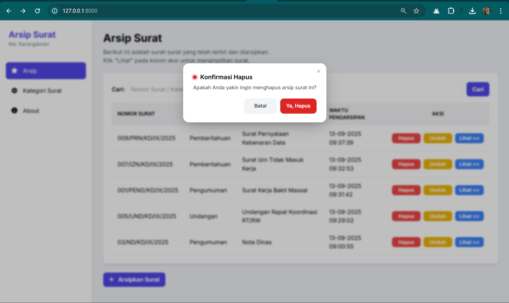

## Judul : SI-Arsip (Sistem Informasi Arsip Surat Desa Karangduren)

## 🎯 Tujuan
Aplikasi ini dibuat untuk membantu perangkat desa dalam **mengelola arsip surat** secara digital agar lebih rapi, mudah dicari, dan aman.  
Dengan adanya sistem ini, pengarsipan tidak lagi dilakukan secara manual menggunakan map atau rak, tetapi terkomputerisasi sehingga menghemat waktu dan tenaga.

---

## ✨ Fitur Utama
- 📂 **Manajemen Arsip Surat**
  - Unggah, lihat, unduh, dan hapus file PDF.
  - Pencarian arsip berdasarkan judul.
- 🗂 **Kategori Surat**
  - CRUD kategori (ID otomatis).
- 👀 **Pratinjau PDF**
  - Bisa dilihat langsung tanpa diunduh (inline iframe).
- 🔔 **Notifikasi**
  - Sistem notifikasi global (toast session).
- 🗑 **Konfirmasi Hapus**
  - Modal konfirmasi sebelum menghapus data.
- ℹ️ **About Page**
  - Menampilkan identitas pembuat dan tanggal pembuatan.

---

### 1. Kebutuhan
* PHP 8.2+
* MySQL / MariaDB (atau sesuaikan `.env` bila pakai SQLite)
* Composer

### 2. Persiapan Database (MySQL)
Jika database `si_arsip` belum ada, bisa buat manual:

```sql
SOURCE database/init/si_arsip.sql;
```

Atau jalankan sendiri di client:

```sql
CREATE DATABASE IF NOT EXISTS si_arsip CHARACTER SET utf8mb4 COLLATE utf8mb4_unicode_ci;
```

### 3. Konfigurasi `.env`
Salin file contoh:
```bash
copy .env.example .env
```
Isi variabel penting (contoh default Laragon / XAMPP):
```
APP_NAME="SI-Arsip"
APP_TIMEZONE=Asia/Jakarta
DB_CONNECTION=mysql
DB_HOST=127.0.0.1
DB_PORT=3306
DB_DATABASE=si_arsip
DB_USERNAME=root
DB_PASSWORD=
FILESYSTEM_DISK=public
SESSION_DRIVER=database
CACHE_STORE=database
QUEUE_CONNECTION=database
```

Generate key:
```bash
php artisan key:generate
```

### 4. Migrasi & Seeder
```bash
php artisan migrate --seed
```
Seeder akan menambahkan 4 kategori default: Undangan, Pengumuman, Nota Dinas, Pemberitahuan.

### 5. Storage Link
```bash
php artisan storage:link
```
Pastikan folder upload PDF: `storage/app/public/pdf` (dibuat otomatis saat unggah pertama).

### 6. Menjalankan Aplikasi
```bash
php artisan serve
```
Buka: http://127.0.0.1:8000


### 7. Screenshot
*Arsip





* Kategori


* About


---

### 8. Dummy Data Arsip Surat
Kumpulan contoh/dummy file PDF untuk diarsipkan dapat diakses di Google Drive:

https://drive.google.com/drive/folders/1RVz1JbeoEF4AQjOu5U-GVtCi4HOdXzec?usp=drive_link

Unduh beberapa file PDF tersebut lalu unggah melalui menu "Arsipkan Surat..." untuk pengujian.

### 9. Catatan Pencarian
Pencarian surat mengikuti requirement.

### 10. Testing Singkat
Unggah PDF contoh kecil (<2MB). Jika pratinjau tidak muncul, cek:
* Symlink storage sudah dibuat
* File berada di `storage/app/public/pdf`

<p align="center"><a href="https://laravel.com" target="_blank"></a></p>

<p align="center">
<a href="https://github.com/laravel/framework/actions"></a>
<a href="https://packagist.org/packages/laravel/framework"></a>
<a href="https://packagist.org/packages/laravel/framework"></a>
<a href="https://packagist.org/packages/laravel/framework"></a>
</p>

## About Laravel

Laravel is a web application framework with expressive, elegant syntax. We believe development must be an enjoyable and creative experience to be truly fulfilling. Laravel takes the pain out of development by easing common tasks used in many web projects, such as:

- [Simple, fast routing engine](https://laravel.com/docs/routing).
- [Powerful dependency injection container](https://laravel.com/docs/container).
- Multiple back-ends for [session](https://laravel.com/docs/session) and [cache](https://laravel.com/docs/cache) storage.
- Expressive, intuitive [database ORM](https://laravel.com/docs/eloquent).
- Database agnostic [schema migrations](https://laravel.com/docs/migrations).
- [Robust background job processing](https://laravel.com/docs/queues).
- [Real-time event broadcasting](https://laravel.com/docs/broadcasting).

Laravel is accessible, powerful, and provides tools required for large, robust applications.

---
